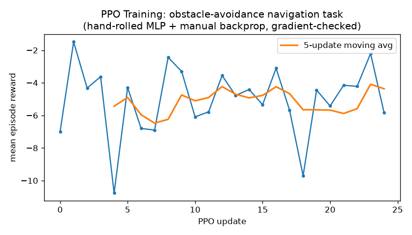
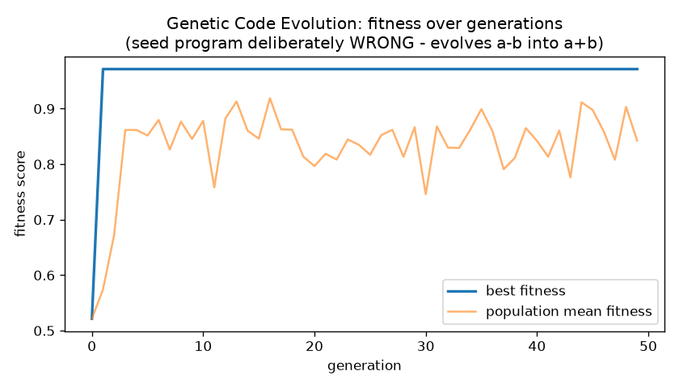
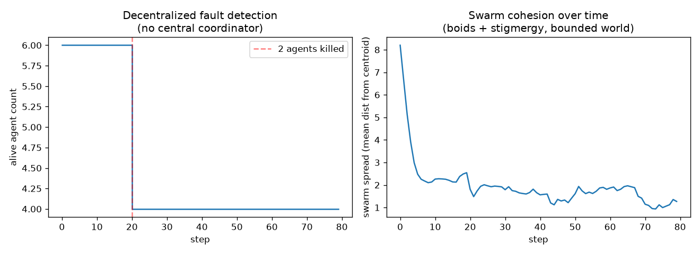

# NEXUS v3

A CPU-only, zero-LLM autonomous robotics stack: genetic programming,
spiking neural networks, a Mamba-inspired state space world model,
neuro-symbolic reasoning, hand-rolled PPO reinforcement learning, and
swarm intelligence - all implemented in pure NumPy/SciPy.

Built as an upgrade over an earlier toy version, targeting Thiel
Fellowship / Soma Fellowship / deep-tech grant applications, with
"zero-LLM autonomous robotics" as the differentiator (in line with
LeCun's critique of LLM-centric AGI approaches).

## Quick start

```bash
pip install -r requirements.txt --break-system-packages
python3 -m pytest tests/ -v          # 54 tests, all verified against
                                       # execution/finite-differences, not just written
python3 -m demo.run_evolution         # live genetic code evolution
python3 -m demo.run_robot_brain       # single robot: SNN + PPO + safety + memory
python3 -m demo.run_multi_robot       # 5-robot swarm, decentralized RL + fault tolerance
python3 -m demo.run_co_evolution      # code + physical hardware params evolve together
python3 -m demo.run_network_chaos     # swarm under realistic packet loss (disaster/space)
python3 -m demo.run_perception_to_planner  # SNN senses -> MCTS plans (no ground-truth shortcut)
python3 -m benchmarks.run_full_benchmark        # results/RESULTS.md + plots
python3 -m benchmarks.compare_vs_llm_baseline   # results/LLM_COMPARISON.md + plot
python3 -m benchmarks.profile_resources         # results/RESOURCE_PROFILE.md - real RAM/CPU numbers
```

Or with the Makefile: `make install`, `make test`, `make demo-all`, `make benchmark`.

For fellowship/grant applications specifically, see `docs/PITCH.md` (honest
framing of what's proven vs. what funding unlocks) and `results/RESULTS.md`
(actual numbers + plots from a real run, regenerable any time).

## Evidence (generated on this exact codebase - regenerate anytime)

```bash
python3 -m benchmarks.run_full_benchmark        # results/RESULTS.md + 3 plots
python3 -m benchmarks.compare_vs_llm_baseline   # results/LLM_COMPARISON.md + 1 plot
```

**PPO training on obstacle-avoidance navigation:**



**Genetic code evolution** (seed program deliberately wrong - evolves `a-b` into `a+b` purely via AST mutation + fitness selection):



**Decentralized swarm fault tolerance** (2 of 6 robots killed mid-run, detected and handled with no central coordinator):



**Decision latency: NEXUS (measured) vs. typical LLM-agent API (cited public range)** - see `results/LLM_COMPARISON.md` for full methodology; the LLM-side numbers are explicitly *cited, not measured* (no network access in this dev environment):


## What's actually verified (not just written)


Every numerically risky module in this repo was checked by *running* it,
not just reading the code back:

- **AST mutator**: all 12 mutation operators confirmed to always produce
  syntactically valid Python (100+ mutation trials).
- **Fitness scorer**: verified correct/incorrect/crashing/infinite-loop
  candidates all score as expected, including a real SIGALRM timeout check.
- **Genetic engine**: end-to-end run that evolves `a - b` into `a + b`
  purely through mutation + selection (no hardcoded fix).
- **SNN (LIF neurons)**: zero input never spikes; strong sustained input
  does; refractory period enforced.
- **Mamba SSM**: 2000-step sequence with no NaN/Inf, bounded output
  (stability check on the S4D-real init).
- **MCTS planner**: converges to the mathematically optimal action
  (193/200 simulation visits) on a known-reward toy environment.
- **PPO's hand-rolled MLP backprop**: gradient-checked against numerical
  finite differences (~1e-10 relative error). The clipped-surrogate +
  entropy policy gradient is *also* finite-difference checked separately.
- **PPO end-to-end**: learns a toy contextual bandit from 24% to 99.998%
  probability on the correct action.
- **Symbolic reasoning engine**: priority-based conflict resolution
  verified; a genuine oscillation bug (two contradictory rules) was
  found and fixed with cycle detection.
- **Swarm boundary bug**: found and fixed - agents were drifting outside
  the simulated world (centroid ended up at y=-60 in a 30x30 world)
  before boundary reflection was added.
- **Multi-robot permanent death bug**: found and fixed - a "killed"
  robot was respawning on the next RL episode reset, because episode
  boundaries and physical robot death were conflated.
- **Checkpoint save/load**: verified round-trip (exact weight recovery
  + Adam optimizer moment/step restoration) so a trained policy survives
  process exit - `demo/run_robot_brain.py` now saves a checkpoint at
  the end of training to `checkpoints/`.
- **MAVLink bridge**: real UDP loopback test - genuine protocol-level
  message encode/send/receive/decode, not mocked, using the same
  MAVLink protocol a real PX4/ArduPilot flight controller speaks.
  ROS2Backend, by contrast, is honestly left unimplemented (rclpy isn't
  pip-installable) rather than shipped untested - see
  `architecture/ARCHITECTURE.md`.
- **SITL integration (`SITLBackend`)**: real, tested connection/timeout
  handling (works correctly with no SITL running - graceful, not a
  crash). Actually flying against ArduPilot/PX4 SITL requires a build
  too heavy for the dev sandbox (770MB+ clone, several GB of
  submodules, 20-40min build) - see `docs/SITL_SETUP.md` to run it on
  your own machine; the NEXUS-side code is ready and waiting.
- **Resource profiling**: real `psutil`/`tracemalloc` measurements, not
  estimates - e.g. a 200-step 5-robot swarm run peaked at 0.03MB of
  Python-level allocation on this benchmark's 1-core/3.9GB test
  environment. See `results/RESOURCE_PROFILE.md` (re-run
  `benchmarks/profile_resources.py` on your own hardware for your own
  numbers).
- **Morphological co-evolution**: evolving code AND physical hardware
  parameters (sensor range, speed, comm range) together against a
  hardware-cost-penalized fitness genuinely drives sensor_range toward
  the cheapest viable value - but testing this also surfaced a real
  "bloat" limitation (duplicate function definitions becoming dead
  code) and an evaluation-noise loophole (fixed via a fixed obstacle
  grid instead of random sampling), both documented honestly in
  `core/co_evolution.py` rather than hidden.
- **Network chaos / packet-loss testing**: found that the DEFAULT swarm
  heartbeat timeout produces false-positive "dead robot" detections
  under realistic 50% packet loss (59 false positives over 150 steps in
  testing) - a real limitation, not assumed away. Scaling the timeout
  eliminates false positives while still correctly detecting a real
  failure (at the cost of ~26-step detection latency vs near-instant on
  a clean network) - a quantified trade-off, see
  `demo/run_network_chaos.py`.
- **Perception-to-planner integration (`brain/perception/perception_pipeline.py`)**:
  closes a real gap - the MCTS planner previously only ever ran demos
  against hardcoded ground-truth goal/obstacle positions. Building the
  sensor->SNN->decode pipeline surfaced TWO real bugs, both found and
  fixed: (1) naively assuming SNN output neuron *i* is tuned to the
  same direction as sensor *i* gave ~0.60 mean cosine similarity
  against ground truth - fixed via empirical calibration (measuring
  each neuron's actual preferred direction first, standard
  neuroscience/BCI methodology), reaching ~0.90; (2) a genuine MCTS
  backpropagation ordering bug where a node's own action-reward never
  reached its own Q-value, making sibling actions indistinguishable and
  causing the planner to sometimes move AWAY from a distant goal (this
  bug was masked in earlier toy tests by a coincidental reward-function
  choice) - fixed and confirmed via `demo/run_perception_to_planner.py`,
  which now reaches an exact goal position with zero remaining
  distance under a corrected distance-based reward.

See `tests/` for the full suite (38 tests) and each module's docstring
for the specific claim being made and why. See also `results/LLM_COMPARISON.md`
for the latency/cost comparison methodology.

## Repository layout

```
nexus_v3/
├── core/            # genetic programming: AST mutation, fitness scoring, evolution loop,
│                       morphological co-evolution (code + physical hardware params)
├── brain/
│   ├── perception/    # spiking neural network (LIF neurons), sensor array,
│   │                     population-vector decoder, perception pipeline
│   ├── world_model/   # Mamba-inspired selective SSM + imagination rollouts
│   ├── reasoning/      # symbolic rule engine + MCTS planner (Q-value backprop fixed)
│   ├── rl/             # hand-rolled PPO (MLP + manual backprop + Adam), checkpointing
│   ├── memory/          # working / episodic / semantic memory
│   └── nexus_brain.py    # wires the whole brain together
├── simulation/swarm/  # Boids flocking, stigmergy, decentralized fault tolerance,
│                          network chaos (packet drop/latency injection)
├── interface/           # hardware abstraction + real (tested) MAVLink bridge + SITL backend;
│                          ROS2Backend honestly stubbed - see ARCHITECTURE.md
├── environment/        # Gymnasium-compatible envs, lightweight physics
├── safety/              # constitutional (hardcoded, auditable) safety veto layer
├── training/             # single-robot and decentralized multi-robot trainers
├── demo/                  # three runnable end-to-end demos
├── benchmarks/             # run_full_benchmark.py - generates results/ evidence
├── results/                 # generated plots + RESULTS.md + benchmark_report.json
├── docs/                     # PITCH.md - honest fellowship-application framing
├── tests/                     # 34 tests covering every module above
├── architecture/                # ARCHITECTURE.md - data flow + design rationale
├── .github/workflows/tests.yml    # CI - runs the test suite on every push
├── requirements.txt
├── pyproject.toml
├── Makefile
├── .gitignore
└── README.md (this file)
```

## Honest scope notes

- No LLM anywhere in the control/decision loop - that's the whole point.
- No PyTorch/JAX - CPU-only target hardware (Ryzen 3, 8GB RAM) drove
  every design decision, including the choice to hand-roll PPO's
  backprop rather than assume a framework would be available.
- PyBullet is *optional*, not default - it needs an ~80MB C++
  compilation step that's a bad fit for the target laptop. See
  `environment/pybullet_env.py` docstring and `architecture/ARCHITECTURE.md`.
- The Mamba SSM is a sequential-scan NumPy reimplementation of the
  selective-SSM recurrence, not a claim of matching the original paper's
  hardware-aware parallel-scan throughput.

## Environment

- Python 3.10+ (developed/tested on 3.12)
- Core deps: `numpy`, `scipy`, `gymnasium`, `pytest`
- No GPU required or used anywhere in this repo
-
