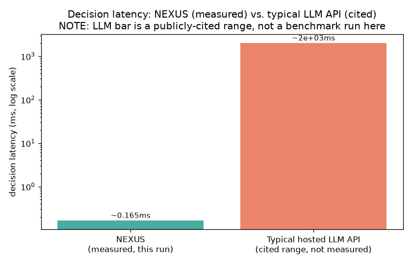

# NEXUS vs. LLM-Agent Baseline - Latency & Cost

**Methodology note (read first):** NEXUS numbers below are measured in this exact run, on this exact hardware, by timing `PPOAgent.act()` over 2000 trials. LLM baseline numbers are NOT measured - this environment has no network/API access - and are cited public typical ranges instead, explicitly labeled as such. Do not read the LLM figures as a precise benchmark.

| | NEXUS (measured) | Typical hosted LLM API (cited range) |
|---|---|---|
| Mean decision latency | **0.1020 ms** | 200-2000 ms (cited) |
| Decisions/sec (1 CPU core) | **9801** | ~0.5-5 (network round-trip bound) |
| Marginal cost per decision | **$0** (local compute) | $0.0001-0.01 (cited) |
| Requires network | **No** | Yes |

Approx. latency speedup vs. cited LLM midpoint: **~10781x** (structural - no network round-trip, no per-token generation - not a claim about decision QUALITY, only speed/cost/offline-capability.)

> Publicly published typical ranges for hosted LLM API calls with short prompts, general industry knowledge as of ~2025/2026 public pricing pages - NOT measured in this environment (no network/API access here). Treat as an order-of-magnitude reference, not a precise benchmark.
